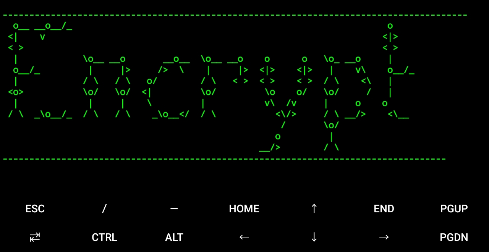
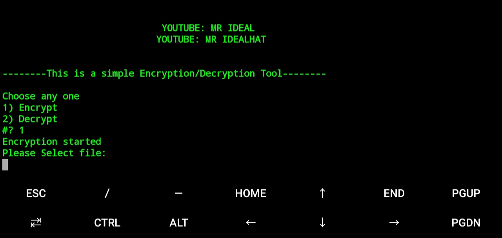

# Encrypt
Encrypt tool can be used to encrypt and decrypt files(one file at a time). 

  

  

This is a simple tool. I don't have coustomized it much more. This tool will run setup file in every execute.
This tool uses prebuilt pakages to encrypt and decrypt files.

# Subscribe
hey there, You can ``subscribe`` <a href="https://youtube.com/c/mridealhat">Mr Idealhat</a> for interesting videos OR follow <a href="https://mr-idealhat.blogspot.com">Mr Idealhat</a> Blogger website for interesting blogs. Search <a href="https://www.youtube.com/channel/UCvAp_a_UY_TnAIZlpX8UmMg">"Adarsh Addee Vlogs"</a> on YouTube and subscribe for my vlog videos. 

# Installation
<pre>
apt-get update && apt-get upgrade-y
</pre>
<pre>
apt-get install git -y
</pre>
<pre>
git clone https://github.com/adarshaddee/Encrypt.git
</pre>
<pre>
cd Encrypt
</pre>
<pre>
chmod +x encrypt.sh
</pre>
<pre>
./encrypt.sh
</pre>

  

# One-line Installation
<pre>
apt-get update && apt-get upgrade-y && apt-get install git-y && git clone https://github.com/adarshaddee/Encrypt.git
</pre>
